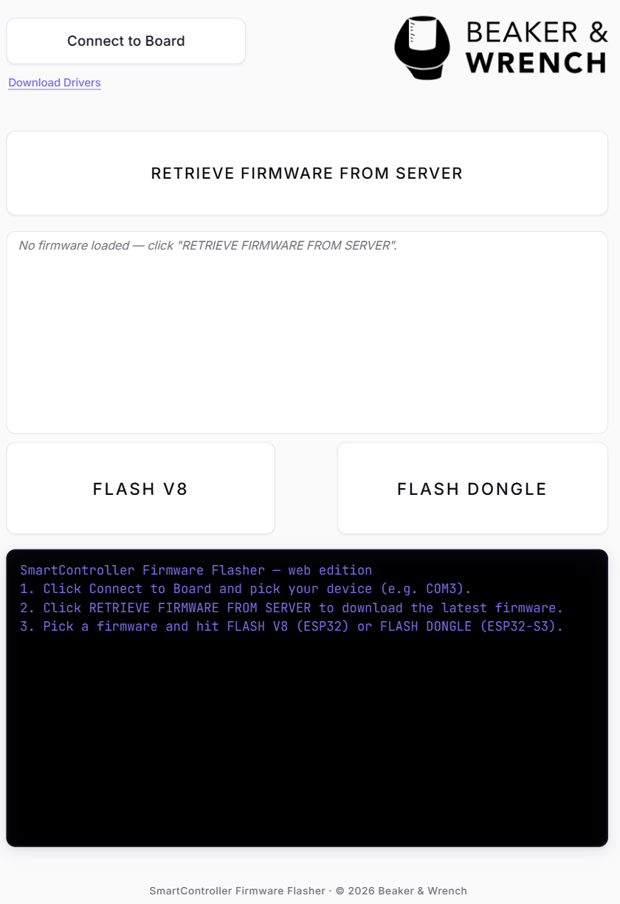

# SmartController Firmware Flasher

A browser-based firmware flasher for the SmartController (ESP32) and Dongle
(ESP32-S3). No installer, no command line — open the page in Chrome or
Edge, connect the board, pull the latest firmware, and flash.

**Live:** <https://hasalabnw.github.io/WebFlasher/>

## How it works

- **Web Serial API** talks directly to the USB-serial adapter; flashing is
  driven by [`esptool-js`](https://github.com/espressif/esptool-js).
- **Retrieve Firmware** pulls the latest `.bin` files from the firmware
  Drive folder after a password unlock.
- Everything lives in a single `index.html` — the page is the whole app.

## Browser requirements

Chrome or Edge 89+ on desktop. Firefox and Safari don't support Web Serial.

## Deployment

The live URL (<https://hasalabnw.github.io/WebFlasher/>) is served by
**GitHub Pages** and redeploys automatically on every push to `main` —
no local build step, no manual action. Expect the new version to be
live **~30–90 seconds after `git push`**.

Pipeline on each push:

1. Push lands on `main`.
2. GitHub triggers its built-in **"pages build and deployment"** workflow
   (visible under the repo's *Actions* tab). No workflow file is checked
   into this repo — it's the zero-config Pages path.
3. The workflow packages the repo's root (`index.html` + `screenshot.png`)
   and uploads it as a Pages artifact.
4. GitHub's CDN picks up the artifact and serves it globally at the
   `*.github.io` URL.

If your own browser doesn't see the update right away, it's CDN/browser
cache — append `?v=<anything>` to the URL, or Ctrl+Shift+R to hard-reload.
A fresh visitor opening the URL will see the new version immediately.
